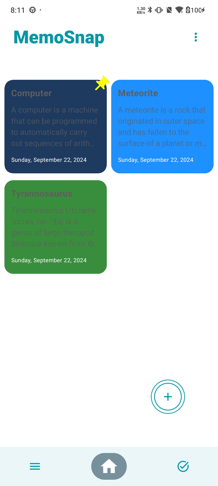
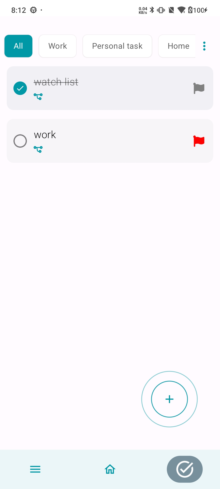

# MathMate

MathMate is a note and task management app built with a clean architecture using the MVVM pattern.
It offers note-taking capabilities, daily task management with prioritization, subtask support, and categorization.

## Tech Stack

- Jetpack Compose: Modern Android UI toolkit for building native UIs declaratively
- Hilt (Dagger): Dependency Injection library to manage dependencies and reduce boilerplate code
- Room: Local database to store and manage notes and tasks offline

## Screenshots

  
  

