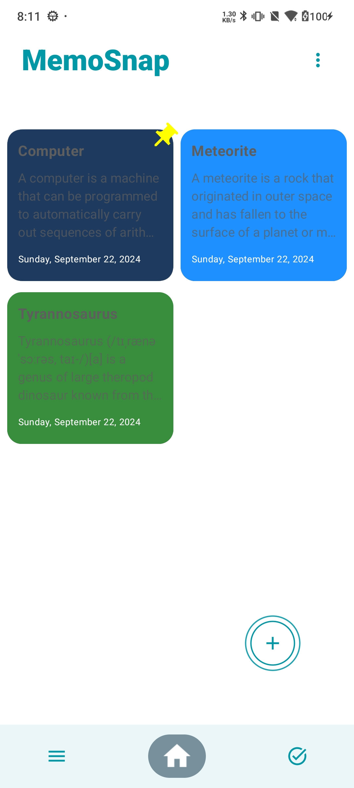

# MemoSnap

MemoSnap is a notes and checklist app built with clean architecture and MVVM.
It supports rich notes, checklist editing, categories, tags, priorities, archive/pin flows, and local-first persistence.

## Tech Stack

- Jetpack Compose: Modern Android UI toolkit for building native UIs declaratively
- Hilt (Dagger): Dependency Injection library to manage dependencies and reduce boilerplate code
- Room: Local database to store and manage notes offline

## Screenshots

  

